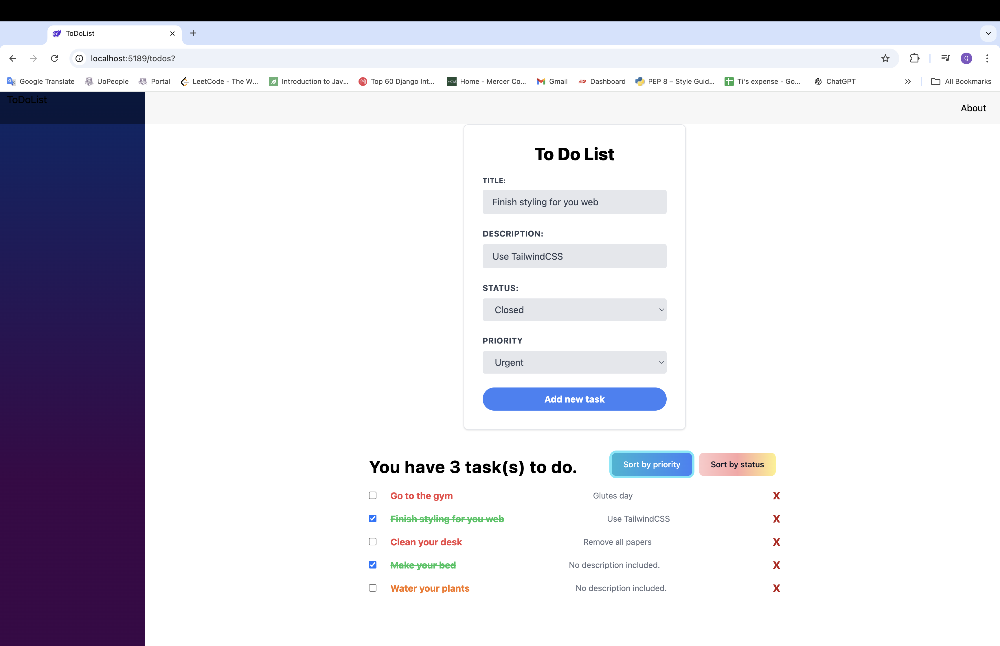

# Blazor To-Do List Application

## Overview 
This is a simple To-Do List application built with <b>Blazor</b> and styled using <b>Tailwind CSS</b>. The app allows users to add tasks, mark them as completed, and sort them by priority or status. It also supports task descriptions and categorizes tasks based on their priority and status.

## Features
- Add new tasks with a title, description, status, and priority.
- Track tasks in three statuses: ```Pending```, ```OnGoing```, and ```Closed```.
- Prioritize tasks as ```Minor```, ```Major```, and ```Urgent```.
- Mark tasks as completed by checking them off. 
- Sort tasks by priority or status
- Responsive design using TailwindCSS for a clean and mordern UI.

## Getting Started
### Prerequisites
Make sure you have the following tools installed:
- .NET SDK
- A code editor like Visual Studio Code or Visual Studio

### Installation
1. Clone the prioirity:
``` git clone https://github.com/quynhnle135/blazor-to-do-list-app.git```

2. Navigate to the project directory:
```cd blazor-todolist```

3. Restore dependencies and run the application:
```dotnet run```

4. Open a browser and navigate to ```https://localhost:5001/todos``` to use the application.

## Screenshots

#### Display tasks


#### Sort by priority


#### Sort by status
